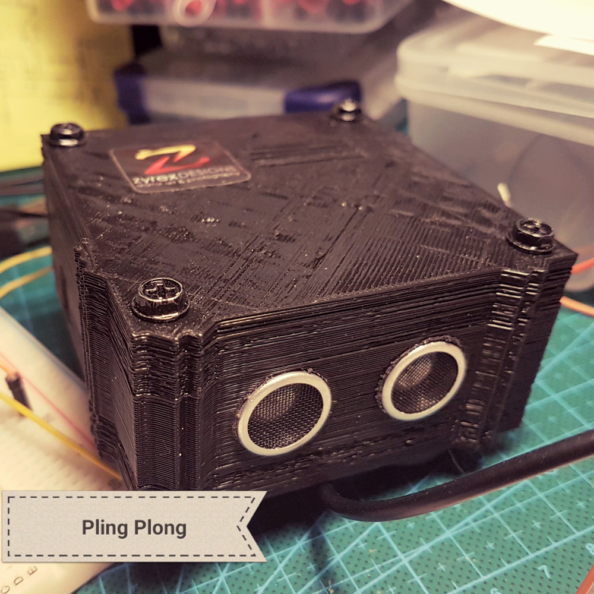

# 433Mhz Doorbell Ringer

### What does it do?
This is the code required to send a 433Mhz binary signal to a unknown brand
of doorbell my friend has which plays a song when in usage. it is super annoying
so in order to make it even more annoying, I created this little project to take care of that.

## Table of content
* Arduino Code
* STL files for 3d Printing.
* Parts List
* Schematics used to make it all work.

### Schematics

## Parts needed
* 1 x Arduino Nano
* 1 X New H34A-433 433Mhz MINI Wireless Transmitter Module ASK 2.6-12V
* 1 x 0.96" I2C IIC Serial 128X64 128*64 White OLED LCD LED Display Module for Arduino
* 1 x Ultrasonic Module HC-SR04 Distance Measuring Transducer Sensor For Arduino/AVR K
* 1 x 100uF Capacitor
* 1 x Momentary Switch
* 1 x 10k resistor (for the switch)

## Spectrum Analysis 433Mhz

## Checking signal in oscilloscope.

## Testing Video.

## All possible sequences
0,0000000000011111010101000
1,0001000000011111010101000
2,0000100000011111010101000
3,0001100000011111010101000
4,0000010000011111010001000
5,0001010000011111010101000
6,0000110000011111010101000
7,0001110000011111010101000
8,0000001000011111010101000
9,0001001000011111010101000
10,0000101000011111010101000
11,0001101000011111010101000
12,0000011000011111010101000
13,0001011000011111010101000
14,0000111000011111010101000
15,0001111000011111010101000
16,0000000100011111010101000
17,0001000100011111010101000
18,0000100100011111010101000
19,0001100100011111010101000
20,0000010100011111010101000
21,0001010100011111010101000
22,0000110100011111010101000
23,0001110100011111010101000
24,0000001100011111010101000
25,0001001100011111010101000
26,0000101100011111010101000
27,0001101100011111010101000
28,0000011100011111010101000
29,0001011100011111010101000
30,0000111100011111010101000
31,0001111100011111010101000
32,0000000010011111010101000
33,0001000010011111010101000
34,0000100010011111010101000
35,0001100010011111010101000
36,0000010010011111010101000
37,0001010010011111010101000
38,0000110010011111010101000
39,0001110010011111010101000
40,0000001010011111010101000
41,0001001010011111010101000
42,0000101010011111010101000
43,0001101010011111010101000
44,0000011010011111010101000
45,0001011010011111010101000
46,0000111010011111010101000
47,0001111010011111010101000
48,0000000110011111010101000
49,0001000110011111010101000
50,0000100110011111010101000
51,0001100110011111010101000
52,0000010110011111010101000
53,0001010110011111010101000
54,0000110110011111010101000
55,0001110110011111010101000
56,0000001110011111010101000
57,0001001110011111010101000
58,0000101110011111010101000
59,0001101110011111010101000
60,0000011110011111010101000
61,0001011110011111010101000
62,0000111110011111010101000
63,0001111110011111010101000
64,0000000001011111010101000
